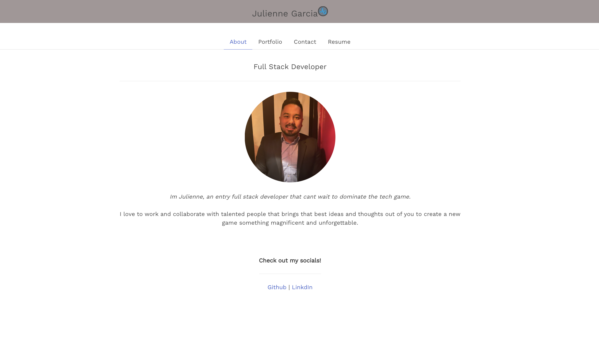

# React Portfolio Description
Module 20 challenge - An updated portfolio showcasing my full stack dev projects. Contains 6 projects, an about me, and the ability to download my resume.

## Table of Contents
- [Live Site](#live-site)
- [Preview](#preview)
- [Tech Used](#tech-used)
- [Installation](#installation)
- [Usage](#usage)
- [Contribution](#contribution)
- [Questions](#questions)

### Live Site
https://jkgdev8.github.io/Portfolio-React-20/

### Preview 

## Installation 

To install this project into your own, use `git clone <REPONAME>` in your command-line, then `npm init` to install the listed dependencies.

## Usage 

To use this repo, go to the cloned files, then type `npm start` in your command-line. Be sure you’re in the correct location in your command-line/terminal first! Be sure you're also set up to run a react app!
preview

